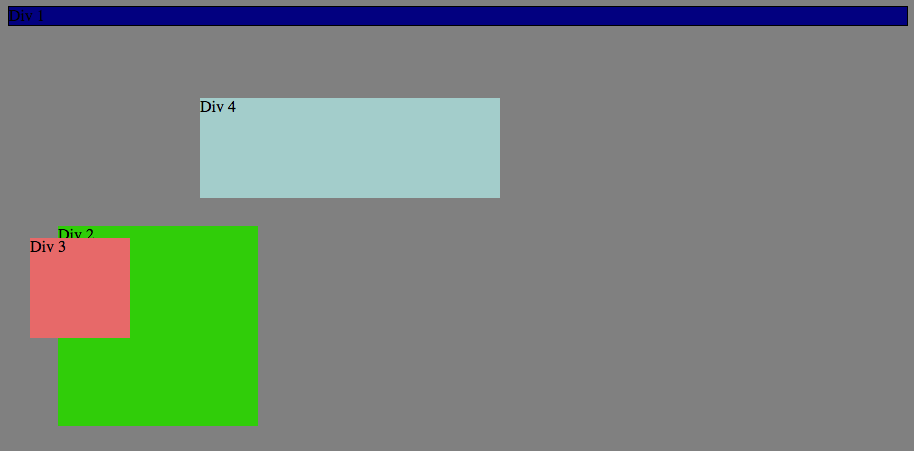
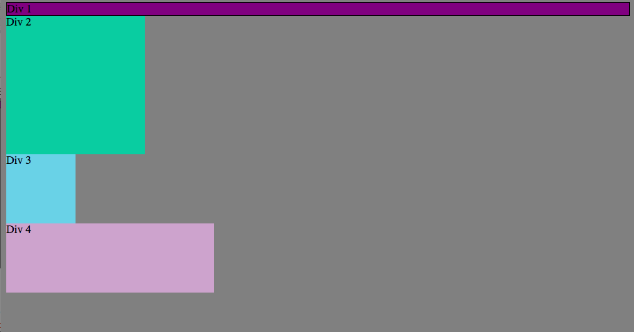
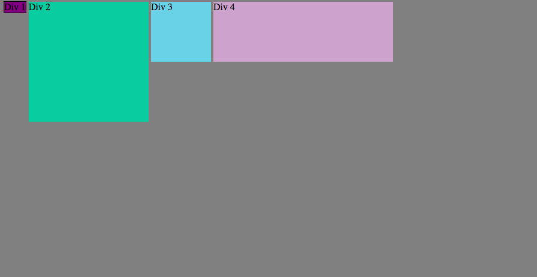
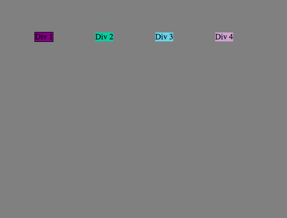
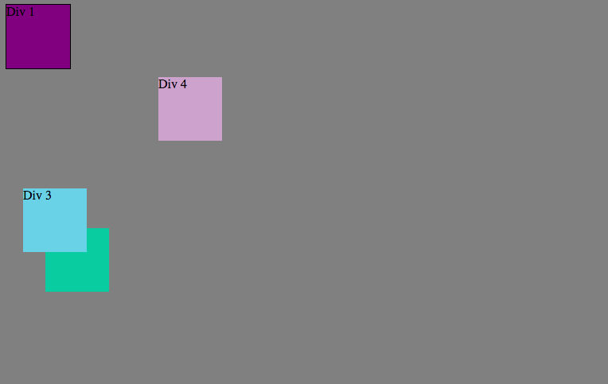
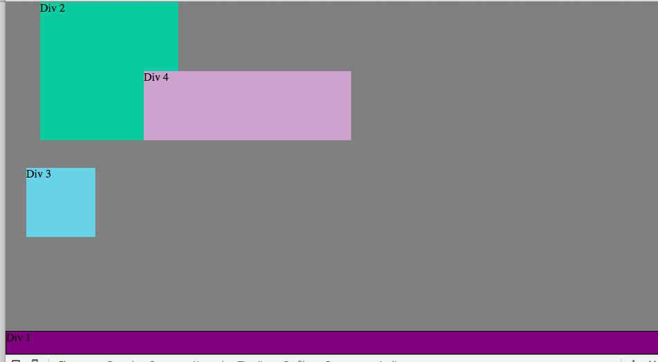
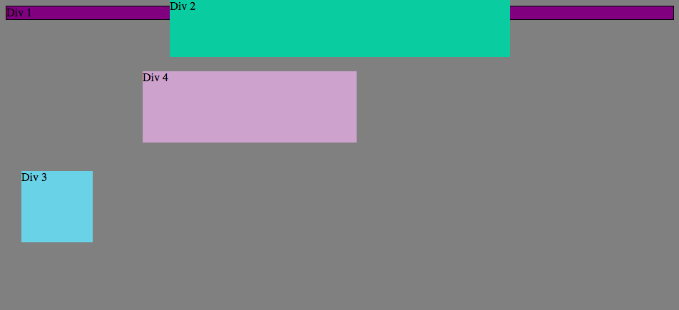
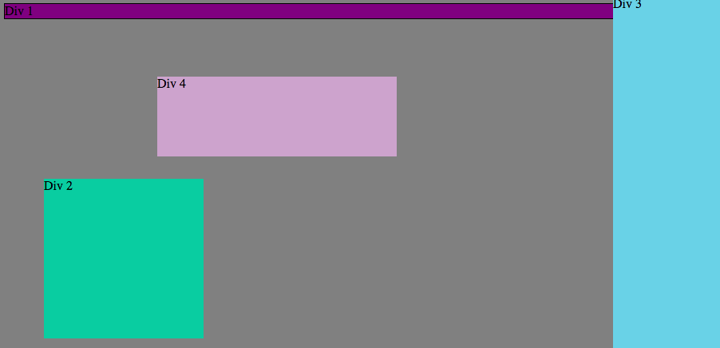
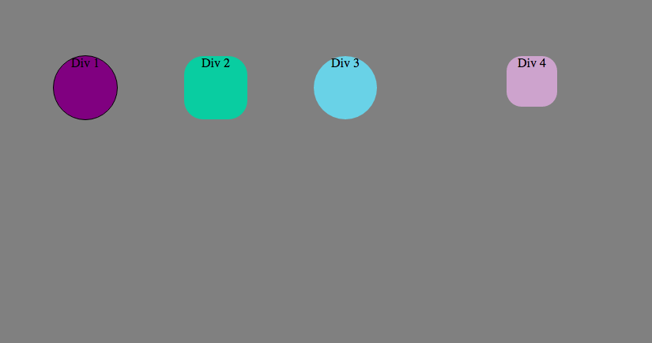

###How can you use Chrome's DevTools inspector to help you format or position elements?

The Chrome DevTools inspector lets you quickly and easily see the effects a change in the css formatting or positioning will have on the webpage. It also helps by allowing the user to see exactly which section will be effected by a certain change in formatting. 

###How can you resize elements on the DOM using CSS?

You can resize elements by changing the width and height.

###What are the differences between absolute, fixed, static, and relative positioning? Which did you find easiest to use? Which was most difficult?

absolute--position element at a specified position relative to the block
fixed--position element at specified position relative to screen and don't move it when scrolled
static--position in the normal flow
relative--lays all elements as though the element were not positioned, and adjusts the element's position without changing layout

I think the easiest to use is absolute because the position is clearly defined by the user. The most difficult is relative because the user has to understand how the positioning relates to other elements. 

###What are the differences between margin, border, and padding?

Margin is the empty space surrounding the border. 
Border is the outline of the element.
Padding is the space inside the border between the border and the element.

###What was your impression of this challenge overall? (love, hate, and why?)

I liked the challenge because it introduced us to the chrome devtools which is a super useful tool that I will definitely use more in the future.