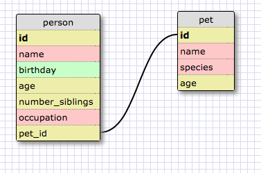
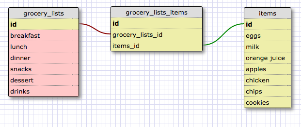

####One-to-One Relationships

This is a one-to-one relationship because if the person does not have a pet, the field will be NULL.

####Many-to-Many Relationships

A grocery list has many items and items can belong to many different grocery lists.

###Reflection

####What is a one-to-one database?

A database where two things have a single relationship to one another.

####When would you use a one-to-one database? (Think generally, not in terms of the example you created).

A one-to-one database is used when you have a relationship where a group of fields can all optionally be empty.

####What is a many-to-many database?

A database where two things have multiple relationships to one another.

####When would you use a many-to-many database? (Think generally, not in terms of the example you created).

A many-to-many database is used when the two things relate to each other in many ways. The information can be connected by a join table.

####What is confusing about database schemas? What makes sense?

It's confusing to break the information down into sections for the table and deciding how to connect to ideas. I think when it comes to complex databases, it will take me awhile to understand what is going on in the schema.